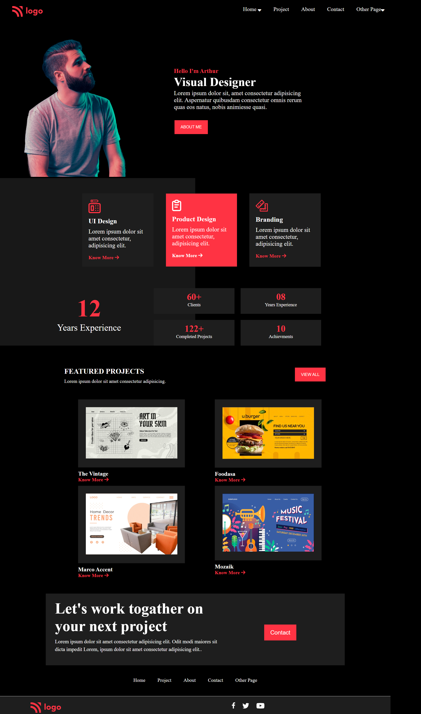

# _Project_ | _Visual Designer_  

_by Tasmiya 💗_

### _Live Link_ -: [Visual Designer]()

## Technologies used

- HTML
- CSS

## 💡 What I have learn ?

- got good understanding of HTML & CSS
- learned about CSS flexbox and CSS positions.
- leaned indepth about background and linear-gradient .

## Time taken to Finish this project

- This project took around 6 hours to complete 😊.
